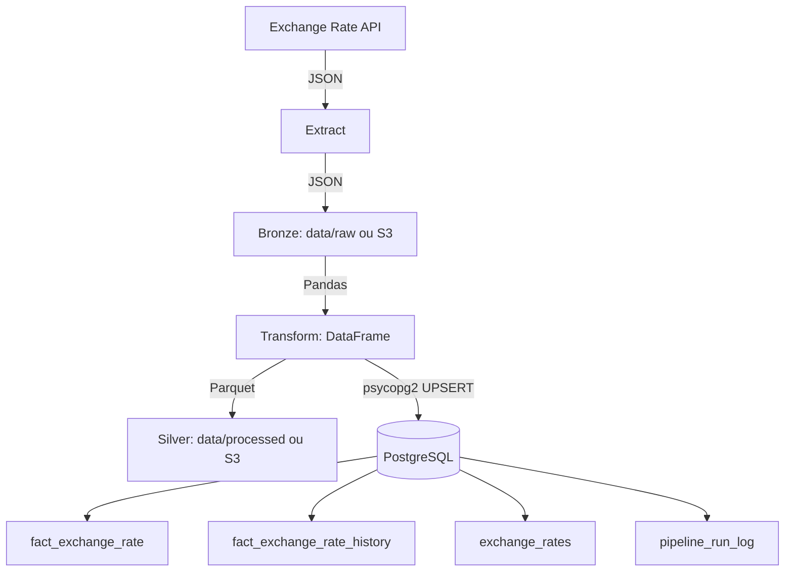
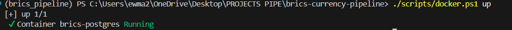
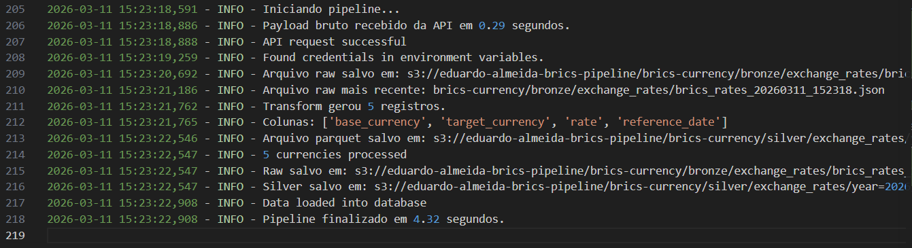
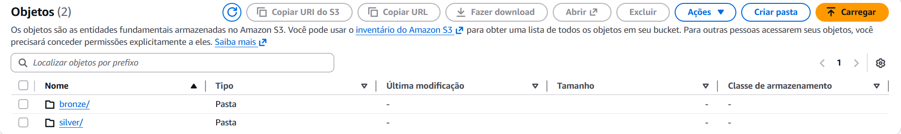
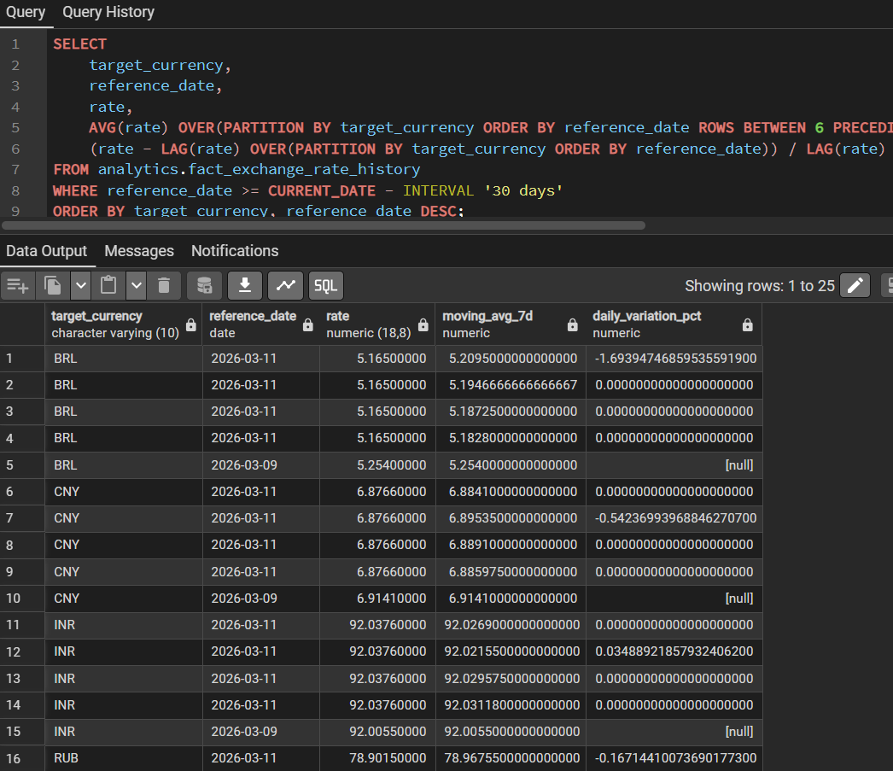

# BRICS Currency Data Pipeline


Um pipeline de dados em estilo de producao que coleta taxas de cambio das moedas do BRICS,
processa os dados com Python e Pandas, e armazena os resultados no PostgreSQL.
Agora o projeto tambem suporta data lake em AWS S3 para persistir as camadas Bronze e Silver.
O projeto inclui testes automatizados, workflows de CI e conteinerizacao com Docker.

## Qual problema este projeto resolve?

Projetos de cambio iniciantes costumam gerar apenas um snapshot momentaneo. Este projeto foca em serie temporal e observabilidade operacional:

- Coleta dados de API publica de cambio.
- Processa e padroniza o payload (JSON -> DataFrame).
- Grava snapshot atual idempotente (UPSERT) e historico append-only.
- Registra execucao, sucesso/falha e volume de dados carregados.
- Persiste dados brutos e curados em um data lake S3 opcional.

## Arquitetura

Fluxo principal:

`API -> Extract -> Bronze -> Transform -> Silver -> PostgreSQL`



## Visualizacao do Projeto

### Infraestrutura conteinerizada


Ambiente de desenvolvimento totalmente conteinerizado, garantindo paridade entre desenvolvimento e producao.

### Observabilidade e logs


Monitoramento detalhado de execucao e rastreabilidade de dados.

### Data Lake em camadas Bronze e Silver


Implementacao de Data Lake com separacao de camadas Bronze (Raw) e Silver (Processed/Parquet).

### Consumo analitico em SQL


Exemplo de consumo analitico utilizando Window Functions para calculo de tendencias cambiais.

## Modelo de dados (PostgreSQL)

Schema: `analytics`

- `fact_exchange_rate`: estado atual por `base_currency`, `target_currency`, `reference_date` (UPSERT).
- `fact_exchange_rate_history`: historico append-only por execucao do pipeline.
- `exchange_rates`: serie temporal simplificada para analise rapida.
- `pipeline_run_log`: auditoria operacional (inicio, fim, status, erro, registros carregados).

## Como executar com Docker (recomendado)

Prerequisitos:

- Docker Desktop
- Docker Compose

1. Clone o repositorio:

```bash
git clone https://github.com/eduardo-wenzel/brics-currency-data-pipeline.git
cd brics-currency-data-pipeline
```

2. Configure ambiente:

```bash
cp .env.example .env
```

No Windows PowerShell, se necessario:

```powershell
Copy-Item .env.example .env
```

3. Suba o banco para o modo com PostgreSQL:

```powershell
./scripts/docker.ps1 up
```

4. Execute o pipeline no container com PostgreSQL:

```powershell
./scripts/docker.ps1 run
```

5. Execute o pipeline no modo S3-only, sem depender do PostgreSQL:

```powershell
./scripts/docker.ps1 run-s3
```

Se quiser manter o container S3-only em execucao:

```powershell
./scripts/docker.ps1 up-s3
./scripts/docker.ps1 logs-s3
```

6. Veja logs e status do modo com PostgreSQL:

```powershell
./scripts/docker.ps1 logs
./scripts/docker.ps1 ps
```

7. Suba o PgAdmin (opcional):

```powershell
./scripts/docker.ps1 pgadmin
```

Acesso PgAdmin: `http://localhost:5050`

8. Pare o ambiente:

```powershell
./scripts/docker.ps1 down
```

## Como executar localmente (desenvolvimento)

1. Crie/ative um ambiente virtual.
2. Instale dependencias:

```bash
pip install -r requirements.txt
pip install -r requirements-dev.txt
```

3. Execute o pipeline:

```bash
python pipeline/run.py
```

Execucao por etapa:

```bash
python pipeline/extract.py
python pipeline/transform.py
```

## Configurando o data lake no S3

Para manter o comportamento atual, use `DATA_LAKE_BACKEND=local`.
Para gravar Bronze e Silver no S3, configure:

```env
DATA_LAKE_BACKEND=s3
AWS_S3_BUCKET=meu-bucket
AWS_S3_PREFIX=brics-currency
AWS_DEFAULT_REGION=us-east-1
S3_BRONZE_PREFIX=bronze/exchange_rates
S3_SILVER_PREFIX=silver/exchange_rates
```

Estrutura gerada no bucket:

- `s3://<bucket>/<prefix>/bronze/exchange_rates/brics_rates_<timestamp>.json`
- `s3://<bucket>/<prefix>/silver/exchange_rates/year=YYYY/month=MM/day=DD/brics_rates_<timestamp>.parquet`

O PostgreSQL continua opcional e pode ser desligado com `SKIP_DB_LOAD=true`.

## Qualidade de codigo e testes

```bash
pytest
ruff check .
black --check .
pre-commit run --all-files
```

## Variaveis de ambiente

Obrigatorias para o pipeline:

- `API_URL`
- `CURRENCIES`
- `DATA_LAKE_BACKEND`

Obrigatorias para S3 quando `DATA_LAKE_BACKEND=s3`:

- `AWS_S3_BUCKET`
- `AWS_S3_PREFIX`
- `AWS_DEFAULT_REGION`
- `S3_BRONZE_PREFIX`
- `S3_SILVER_PREFIX`
- Credenciais AWS padrao (`AWS_ACCESS_KEY_ID`, `AWS_SECRET_ACCESS_KEY`, `AWS_SESSION_TOKEN`, se aplicavel)

Obrigatorias para carga relacional no PostgreSQL:

- `PG_HOST`
- `PG_DATABASE`
- `PG_USER`
- `PG_PASSWORD`
- `PG_PORT`

Opcionais para PgAdmin (Docker):

- `PGADMIN_DEFAULT_EMAIL`
- `PGADMIN_DEFAULT_PASSWORD`

Opcionais para alertas CI:

- `SLACK_WEBHOOK_URL`
- `EMAIL_SMTP_SERVER`
- `EMAIL_SMTP_PORT`
- `EMAIL_USERNAME`
- `EMAIL_PASSWORD`
- `EMAIL_TO`
- `EMAIL_FROM`

## Automacao e CI/CD

- Local: `scripts/register_task.ps1` (Windows Task Scheduler).
- GitHub Actions: `.github/workflows/pipeline.yml` para execucao automatizada e checks de qualidade.

## Roadmap

- [x] Migrar camadas de dados locais para S3 (Bronze/Silver).
- [ ] Adotar orquestrador dedicado (Airflow ou Dagster).
- [ ] Adicionar testes de qualidade de dados (dbt/Great Expectations).
- [ ] Expor dashboards em ferramenta de BI (Metabase/Superset).
- [ ] Provisionar infraestrutura com Terraform.
