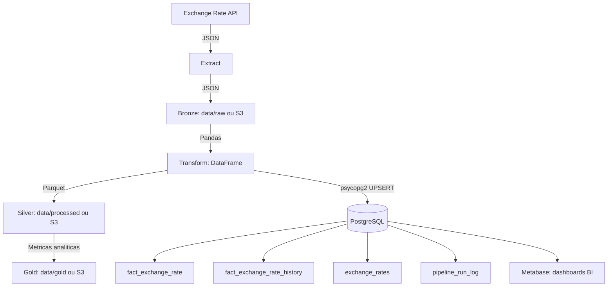
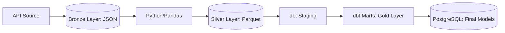
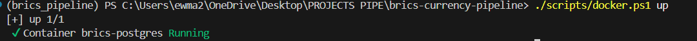
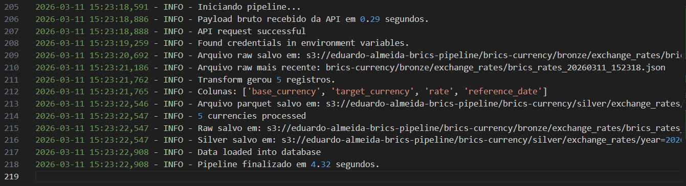
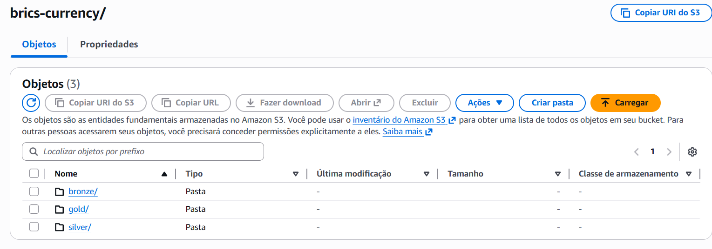
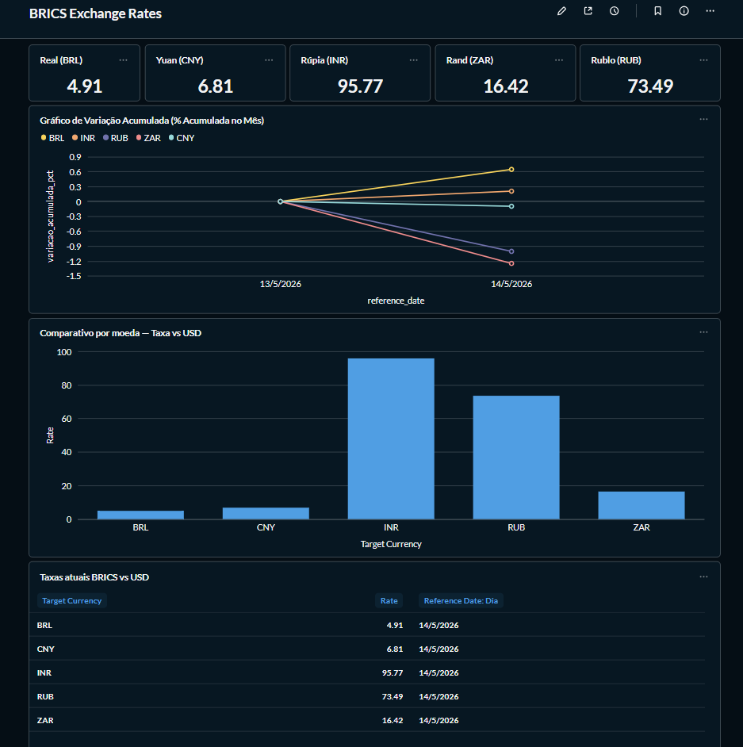
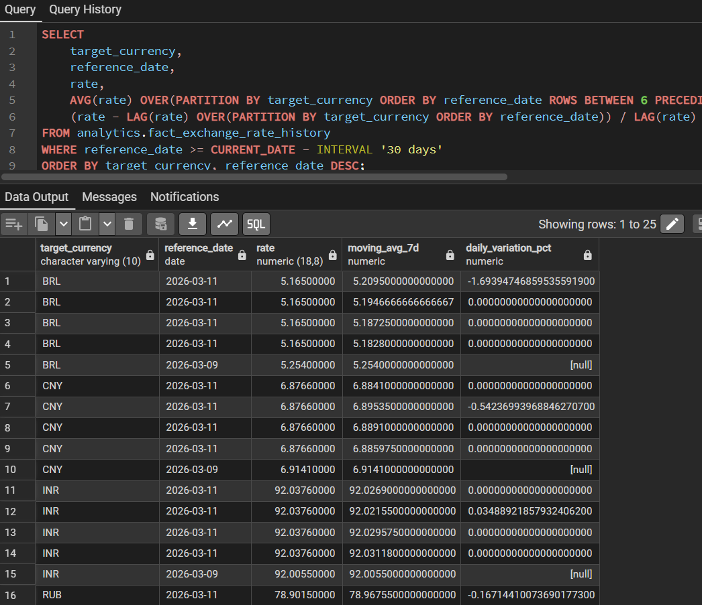

# BRICS Currency Data Pipeline


Um pipeline de dados em estilo de producao que coleta taxas de cambio das moedas do BRICS,
processa os dados com Python e Pandas, e armazena os resultados no PostgreSQL.
Agora o projeto tambem suporta data lake em AWS S3 para persistir as camadas Bronze, Silver e Gold.
O projeto inclui testes automatizados, workflows de CI e conteinerizacao com Docker.
Tambem inclui uma DAG opcional do Apache Airflow para orquestrar o fluxo fim a fim.
As rotinas operacionais tambem possuem alternativas cross-platform via shell script e `Makefile`.

## Qual problema este projeto resolve?

Projetos de cambio iniciantes costumam gerar apenas um snapshot momentaneo. Este projeto foca em serie temporal e observabilidade operacional:

- Coleta dados de API publica de cambio.
- Processa e padroniza o payload (JSON -> DataFrame).
- Grava snapshot atual idempotente (UPSERT) e historico append-only.
- Registra execucao, sucesso/falha e volume de dados carregados.
- Persiste dados brutos, curados e analiticos em um data lake S3 opcional.

## Arquitetura

Fluxo principal:

`API -> Extract -> Bronze -> Transform -> Silver -> Gold -> PostgreSQL`


```mermaid
graph TD
    A[Exchange Rate API] -->|JSON| B[Extract]
    B -->|JSON| C[Bronze: data/raw ou S3]
    C -->|Pandas| D[Transform: DataFrame]
    D -->|Parquet| E[Silver: data/processed ou S3]
    E -->|Metricas analiticas| K[Gold: data/gold ou S3]
    D -->|psycopg2 UPSERT| F[(PostgreSQL)]

    F --> G[fact_exchange_rate]
    F --> H[fact_exchange_rate_history]
    F --> I[exchange_rates]
    F --> J[pipeline_run_log]
    F --> L[Metabase: dashboards BI]
```

## Linhagem dos Dados

O fluxo de linhagem abaixo destaca o ciclo de vida completo do dado, desde a API publica ate os modelos finais consumiveis:


```mermaid
graph LR
    A[API Source] --> B[(Bronze Layer: JSON)]
    B --> C[Python/Pandas]
    C --> D[(Silver Layer: Parquet)]
    D --> E[dbt Staging]
    E --> F[dbt Marts: Gold Layer]
    F --> G[(PostgreSQL: Final Models)]
```

## Visualizacao do Projeto

### Infraestrutura conteinerizada


Ambiente de desenvolvimento totalmente conteinerizado, garantindo paridade entre desenvolvimento e producao.

### Observabilidade e logs


Monitoramento detalhado de execucao e rastreabilidade de dados.

### Data Lake em camadas Bronze, Silver e Gold


Implementacao de Data Lake com separacao de camadas Bronze (Raw), Silver (Processed/Parquet) e Gold (metricas analiticas).

### Dashboard BI com Metabase


## Camadas do Data Lake

- Bronze: payload bruto da API, sem enriquecimento.
- Silver: dados normalizados por moeda e data de referencia.
- Gold: visao analitica derivada da Silver com taxa anterior, variacao absoluta, variacao percentual, tendencia e ranking por snapshot.

## Modelo Medalhao

- Bronze: raw API response persistido em JSON, sem regras de negocio aplicadas.
- Silver: dados limpos, normalizados e particionados em Parquet para consumo tecnico e reprocessamento.
- Gold: modelos analiticos prontos para negocio, com metricas e estruturas consumiveis via dbt e PostgreSQL.

### Consumo analitico em SQL


Exemplo de consumo analitico utilizando Window Functions para calculo de tendencias cambiais.

## Modelo de dados (PostgreSQL)

Schema: `analytics`

- `fact_exchange_rate`: estado atual por `base_currency`, `target_currency`, `reference_date` (UPSERT).
- `fact_exchange_rate_history`: historico append-only por execucao do pipeline.
- `exchange_rates`: serie temporal simplificada para analise rapida.
- `pipeline_run_log`: auditoria operacional (inicio, fim, status, erro, registros carregados).

## Como executar com Docker (recomendado)

Prerequisitos:

- Docker Desktop
- Docker Compose

1. Clone o repositorio:

```bash
git clone https://github.com/eduardo-wenzel/brics-currency-data-pipeline.git
cd brics-currency-pipeline
```

2. Configure ambiente:

```bash
cp .env.example .env
```

No Windows PowerShell, se necessario:

```powershell
Copy-Item .env.example .env
```

3. Suba o banco para o modo com PostgreSQL:

```powershell
./scripts/docker.ps1 up
```

Opcao cross-platform:

```bash
./scripts/docker.sh up
```

4. Execute o pipeline no container com PostgreSQL:

```powershell
./scripts/docker.ps1 run
```

Opcao cross-platform:

```bash
./scripts/docker.sh run
```

5. Execute o pipeline no modo S3-only, sem depender do PostgreSQL:

```powershell
./scripts/docker.ps1 run-s3
```

Se quiser manter o container S3-only em execucao:

```powershell
./scripts/docker.ps1 up-s3
./scripts/docker.ps1 logs-s3
```

Ou, em ambientes Linux/macOS:

```bash
./scripts/docker.sh up-s3
./scripts/docker.sh logs-s3
```

6. Veja logs e status do modo com PostgreSQL:

```powershell
./scripts/docker.ps1 logs
./scripts/docker.ps1 ps
```

7. Suba o PgAdmin (opcional):

```powershell
./scripts/docker.ps1 pgadmin
```

Acesso PgAdmin: `http://localhost:5050`

8. Suba o Metabase para dashboards visuais de BI (opcional):

```powershell
./scripts/docker.ps1 metabase
```

Opcao cross-platform:

```bash
./scripts/docker.sh metabase
```

Acesso Metabase: `http://localhost:3000`

Na configuracao inicial do Metabase, conecte o banco PostgreSQL usando:

- host: `postgres`
- porta: `5432`
- database: valor de `PG_DATABASE` (padrao Docker: `brics_pipeline`)
- usuario: valor de `PG_USER` (padrao Docker: `postgres`)
- senha: valor de `PG_PASSWORD` (padrao Docker: `postgres`)
- schemas recomendados para analise: `analytics`, `marts` e `staging`

Logs do Metabase:

```powershell
./scripts/docker.ps1 logs-metabase
```

9. Pare o ambiente:

```powershell
./scripts/docker.ps1 down
```

Atalhos adicionais:

```bash
make
make up
make run
make metabase
make down
make pipeline
```

O alvo padrao `make` exibe um resumo dos comandos operacionais mais usados, evitando dependencia dos scripts PowerShell em ambientes Linux/macOS.

## Orquestracao com Airflow

O projeto agora inclui a DAG `brics_currency_pipeline`, que reaproveita as mesmas funcoes de extract, transform e load do pipeline Python. O fluxo no Airflow fica:

`extract_task -> transform_task -> gold_task -> load_task`

Para subir a stack do Airflow com Docker:

```powershell
./scripts/docker.ps1 up-airflow
```

Interface web: `http://localhost:8080`

Credenciais padrao:

- usuario: `airflow`
- senha: `airflow`

Logs do orquestrador:

```powershell
./scripts/docker.ps1 logs-airflow
```

Configuracoes relacionadas ao Airflow no `.env`:

- `AIRFLOW_SCHEDULE`: cron da DAG (padrao: a cada 6 horas)
- `AIRFLOW_TASK_RETRIES`: numero de retentativas por task no Airflow
- `AIRFLOW_RETRY_DELAY_SECONDS`: atraso inicial entre retentativas
- `AIRFLOW_ADMIN_USERNAME`
- `AIRFLOW_ADMIN_PASSWORD`
- `AIRFLOW_ADMIN_EMAIL`
- `AIRFLOW_SECRET_KEY`
- `AIRFLOW_FERNET_KEY`

Instalacao local do Airflow fora do Docker:

```bash
pip install -r requirements-airflow.txt
```

Observacao: a DAG usa o mesmo PostgreSQL do projeto para metadata do Airflow e para as tabelas analiticas, mas os objetos permanecem separados logicamente.

Para evitar deadlocks na carga relacional quando houver disparos manuais e agendados ao mesmo tempo, a DAG foi configurada com `max_active_runs=1`, garantindo apenas uma execucao ativa por vez.
As tasks tambem usam retry com backoff exponencial nativo do Airflow, o que reduz a fragilidade operacional quando a API publica falha temporariamente.

## Como executar localmente (desenvolvimento)

1. Crie/ative um ambiente virtual.
2. Instale dependencias:

```bash
pip install -r requirements.txt
pip install -r requirements-dev.txt
```

3. Execute o pipeline:

```bash
python -m pipeline.migrations
python -m pipeline.run
```

Pipeline completo + camada analitica com scripts cross-platform:

```bash
./scripts/run_pipeline.sh
./scripts/dbt.sh run
./scripts/dbt.sh test
```

Execucao por etapa:

```bash
python -m pipeline.extract
python -m pipeline.transform
python -m pipeline.gold
```

O comando `python -m pipeline.migrations` aplica os arquivos SQL em `sql/` e registra as versoes em `public.schema_migrations`.
Os scripts `dbt.sh` e `dbt.ps1` permitem rodar apenas as transformacoes e testes da camada analitica sem reexecutar a ingestao.

## Configurando o data lake no S3

Para manter o comportamento atual, use `DATA_LAKE_BACKEND=local`.
Para gravar Bronze, Silver e Gold no S3, configure:

```env
DATA_LAKE_BACKEND=s3
AWS_S3_BUCKET=meu-bucket
AWS_S3_PREFIX=brics-currency
AWS_DEFAULT_REGION=us-east-1
S3_BRONZE_PREFIX=bronze/exchange_rates
S3_SILVER_PREFIX=silver/exchange_rates
S3_GOLD_PREFIX=gold/exchange_rates
```

Estrutura gerada no bucket:

- `s3://<bucket>/<prefix>/bronze/exchange_rates/brics_rates_<timestamp>.json`
- `s3://<bucket>/<prefix>/silver/exchange_rates/year=YYYY/month=MM/day=DD/brics_rates_<timestamp>.parquet`
- `s3://<bucket>/<prefix>/gold/exchange_rates/year=YYYY/month=MM/day=DD/brics_rates_<timestamp>.parquet`

O PostgreSQL continua opcional e pode ser desligado com `SKIP_DB_LOAD=true`.

## Resiliencia da extracao

O pipeline agora suporta retry com backoff exponencial e endpoint secundario opcional para a coleta da API:

```env
API_URL=https://api.exchangerate-api.com/v4/latest/USD
API_FALLBACK_URL=
API_MAX_RETRIES=3
API_RETRY_BACKOFF_SECONDS=1.0
```

- `API_URL`: endpoint primario.
- `API_FALLBACK_URL`: endpoint alternativo usado quando o primario esgota as tentativas.
- `API_MAX_RETRIES`: numero de tentativas por endpoint.
- `API_RETRY_BACKOFF_SECONDS`: atraso inicial entre tentativas, com multiplicacao exponencial.

Quando executado via Airflow, o pipeline combina esse retry da camada Python com as retentativas nativas do orquestrador. Na pratica, falhas transientes da API podem ser absorvidas primeiro no request e, se persistirem, por uma nova tentativa da task no scheduler.

## Qualidade de codigo e testes

```bash
pytest
ruff check .
black --check .
pre-commit run --all-files
```

## Data Quality & Testing

- Pytest: valida a logica de extracao, retries, normalizacao, transformacao, geracao da camada Gold e fluxos principais do pipeline Python.
- dbt Tests: garantem qualidade dos dados analiticos, incluindo taxas positivas, unicidade de snapshots, integridade referencial e consistencia operacional das tabelas carregadas.
- GitHub Actions: executa automaticamente os checks de qualidade e o pipeline agendado.

## Qualidade de dados com dbt

O projeto agora inclui uma estrutura `dbt` mais alinhada ao fluxo classico de analytics engineering:

- `sources`: declaracao das tabelas mantidas pelo pipeline Python no schema `analytics`;
- `staging`: views com tipagem e padronizacao de nomes;
- `marts`: views analiticas consumiveis e ponto principal para testes de negocio.

Os testes cobrem regras como:

- chaves obrigatorias nas tabelas analiticas;
- unicidade do snapshot em `fact_exchange_rate`;
- valores aceitos para status do `pipeline_run_log`;
- relacao entre historico e execucoes do pipeline;
- taxas de cambio sempre positivas;
- consistencia entre `finished_at` e o status da execucao.

Prerequisito recomendado:

- usar um ambiente Python 3.12 ou 3.13 para o `dbt`;
- preencher as variaveis `PG_HOST`, `PG_DATABASE`, `PG_USER`, `PG_PASSWORD` e `PG_PORT` no arquivo `.env`.

Instalacao:

```bash
pip install -r requirements-dev.txt
```

Execucao no Windows PowerShell:

```powershell
./scripts/dbt.ps1 run
./scripts/dbt.ps1 test
```

Execucao em Linux/macOS:

```bash
./scripts/dbt.sh run
./scripts/dbt.sh test
```

Atalhos uteis:

```bash
./scripts/dbt.sh debug
./scripts/dbt.sh parse
./scripts/dbt.sh build
```

Os scripts carregam o `.env` automaticamente e validam as variaveis obrigatorias antes de chamar o `dbt`.
Ao executar `run` ou `build`, o dbt passa a materializar os schemas `staging` e `marts` no PostgreSQL, desde que o usuario do banco tenha permissao para criar schemas e views.

Atalho pelo Makefile em ambientes com `make`:

```bash
make dbt-test
```

O profile do dbt usa as mesmas variaveis `PG_HOST`, `PG_DATABASE`, `PG_USER`, `PG_PASSWORD` e `PG_PORT` ja utilizadas pelo pipeline Python.

## Variaveis de ambiente

Obrigatorias para o pipeline:

- `API_URL`
- `CURRENCIES`
- `DATA_LAKE_BACKEND`

Opcionais para resiliencia da API:

- `API_FALLBACK_URL`
- `API_MAX_RETRIES`
- `API_RETRY_BACKOFF_SECONDS`

Obrigatorias para S3 quando `DATA_LAKE_BACKEND=s3`:

- `AWS_S3_BUCKET`
- `AWS_S3_PREFIX`
- `AWS_DEFAULT_REGION`
- `S3_BRONZE_PREFIX`
- `S3_SILVER_PREFIX`
- `S3_GOLD_PREFIX`
- Credenciais AWS padrao (`AWS_ACCESS_KEY_ID`, `AWS_SECRET_ACCESS_KEY`, `AWS_SESSION_TOKEN`, se aplicavel)

Obrigatorias para carga relacional no PostgreSQL:

- `PG_HOST`
- `PG_DATABASE`
- `PG_USER`
- `PG_PASSWORD`
- `PG_PORT`

Opcionais para PgAdmin (Docker):

- `PGADMIN_DEFAULT_EMAIL`
- `PGADMIN_DEFAULT_PASSWORD`

Opcionais para Metabase (Docker):

- `METABASE_IMAGE`
- `METABASE_PORT`
- `METABASE_SITE_URL`

Opcionais para Airflow:

- `AIRFLOW_SCHEDULE`
- `AIRFLOW_TASK_RETRIES`
- `AIRFLOW_RETRY_DELAY_SECONDS`
- `AIRFLOW_ADMIN_USERNAME`
- `AIRFLOW_ADMIN_PASSWORD`
- `AIRFLOW_ADMIN_EMAIL`
- `AIRFLOW_SECRET_KEY`
- `AIRFLOW_FERNET_KEY`

Opcionais para alertas CI:

- `SLACK_WEBHOOK_URL`
- `EMAIL_SMTP_SERVER`
- `EMAIL_SMTP_PORT`
- `EMAIL_USERNAME`
- `EMAIL_PASSWORD`
- `EMAIL_TO`
- `EMAIL_FROM`

## Automacao e CI/CD

- Producao/orquestracao: `dags/brics_currency_pipeline_dag.py` com Apache Airflow.
- Local apenas: `scripts/register_task.ps1` (Windows Task Scheduler) como conveniencia para ambientes Windows sem orquestrador dedicado.
- GitHub Actions: `.github/workflows/pipeline.yml` para execucao automatizada e checks de qualidade.

Para um ambiente production-ready, prefira Airflow como scheduler principal. O uso de Windows Task Scheduler fica restrito a demonstracoes locais, labs ou automacoes simples em maquina unica.

## Roadmap

- [x] Migrar camadas de dados locais para S3 (Bronze/Silver/Gold).
- [x] Adotar orquestrador dedicado com Airflow.
- [x] Adicionar testes de qualidade de dados com dbt.
- [x] Expor dashboards em ferramenta de BI com Metabase.
- [ ] Provisionar infraestrutura com Terraform.
